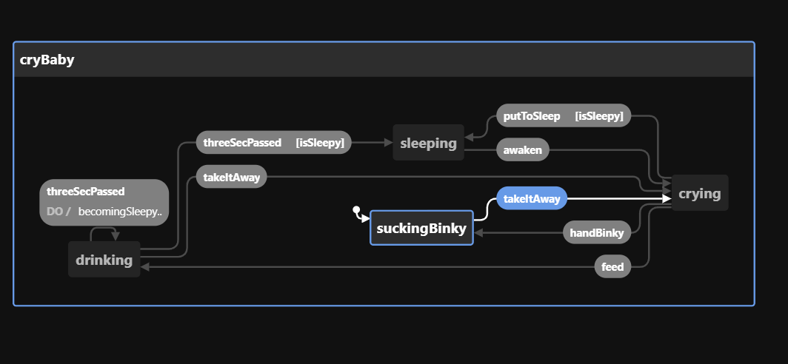

# Simple model-based-development example using xstate (and svelte, playwright)

- [Simple model-based-development example using xstate (and svelte, playwright)](#simple-model-based-development-example-using-xstate-and-svelte-playwright)
  - [About](#about)
  - [What is model-based development?](#what-is-model-based-development)
  - [How to run tests](#how-to-run-tests)
  - [Writing your own tests](#writing-your-own-tests)
  - [Extra tip](#extra-tip)
    - [Controlling test generation](#controlling-test-generation)

## About

This example was originally written for a lightning talk in Japanese Svelte meetup.
[Youtube link](https://youtu.be/LMRtvOEboPY)

I noticed a few comments on the video asking for an English translation.
Instead of recording/writing a translation for the video, I decided to

1. Translate the code into English
2. Explain my understanding of model-based development here in this readme.

## What is model-based development?

Model-based development is less about actual implementation details and more about having a shared idea across an organization on how their service should behave.

The goal is to have a documentation that

1. Both tech and non-tech people can understand
2. Doesn't rot

To achieve ①, we use a state chart to represent the specifications. This is what I refer to as a **model**.



Document/code rotting happens when the model is not maintained, which often happens when it is outside of the regular work flow.

To achieve ②, the model is used to create end-to-end tests for the application (model-based testing).

Say a team wants to implement a new feature. They could approach it with the following procedure:

1. Product manager and UX designer translate the specification into a model. (Most likely using a no-code tool like [xstate visual editor](https://stately.ai/registry/new)). This model is passed to the lead engineer and will be [imported into the code base](test/suites/babySitter/model.ts).
2. The lead engineer creates e2e tests based on the model by creating [checks](test/suites/babySitter/checks.ts) for each state that needs to be tested. They then connect actual [events](test/suites/babySitter/events.ts) with the events defined in the model, and finally put it all together by [generating test cases](test/suites/babySitter/index.spec.ts).
3. The engineering team starts implementing the feature. They may or may not use `xstate` or a test-driven approach. What ever they do, the branch should only be merged when generated model-based tests have passed.

## How to run tests

To run tests, simply execute `pnpm test`.

_If Playwright complains about missing dependencies like chrome or whatever, run `pnpm setup:test` and then try again._

## Writing your own tests

In this code base I created `ModelBasedTest` class to  make it easy to generate tests. Simply press `ctrl space`  and follow the method listed by Typescript.

```ts
import { ModelBasedTest, test } from '@t/helpers';

test.describe('hey!', () => {
  new ModelBasedTest(model, config, implementation?)
    .setup(setup)
    .registerChecks(checks)
    .registerEvents(events)
    .generateShortestPath()
    .withCoverage();
})
```

## Extra tip

### Controlling test generation

When generating tests with `shortestPath` or `simplePath`, you can still control the generation indirectly by controlling `machine.context`. This is because the `unique state` as seen by `@xstate/test` is actually a combination of `state` and `context`.

```ts
const config = {
  initial: 'one',
  context: { key: 0 },
  states: {
    one: {
      on: { NEXT: { target: 'two' } },
      exit: model.assign({ key: 0 })
    },
    two: {
      on: {
        // Here transition from 'two' to 'one' won't be tested if you don't make any change to the context, since 'one' is already marked as visited.
        PREV: { target: 'one', actions: model.assign({ key: 1 }) },
        NEXT: { target: 'three' }
      },
      // You want to reset the context (key) when leaving the state that has been `forced` to test, otherwise other states will become unique as well.
      exit: model.assign({ key: 0 })
    },
    three: {
      on: {
        PREV: { target: 'two', actions: model.assign({ key: 1 }) },
        // Here we are assigning 2 instead of 1, which makes this transition unique. { state: 'one', context: { key: 2 } }
        RESTART: { target: 'one', actions: model.assign({ key: 2 }) }
      }
    },
  }
}
```

In the case of `babySitter`, if you remove the context `isSleepy` from the `model` and it's `implementations`, the number of generated tests will decrease.
